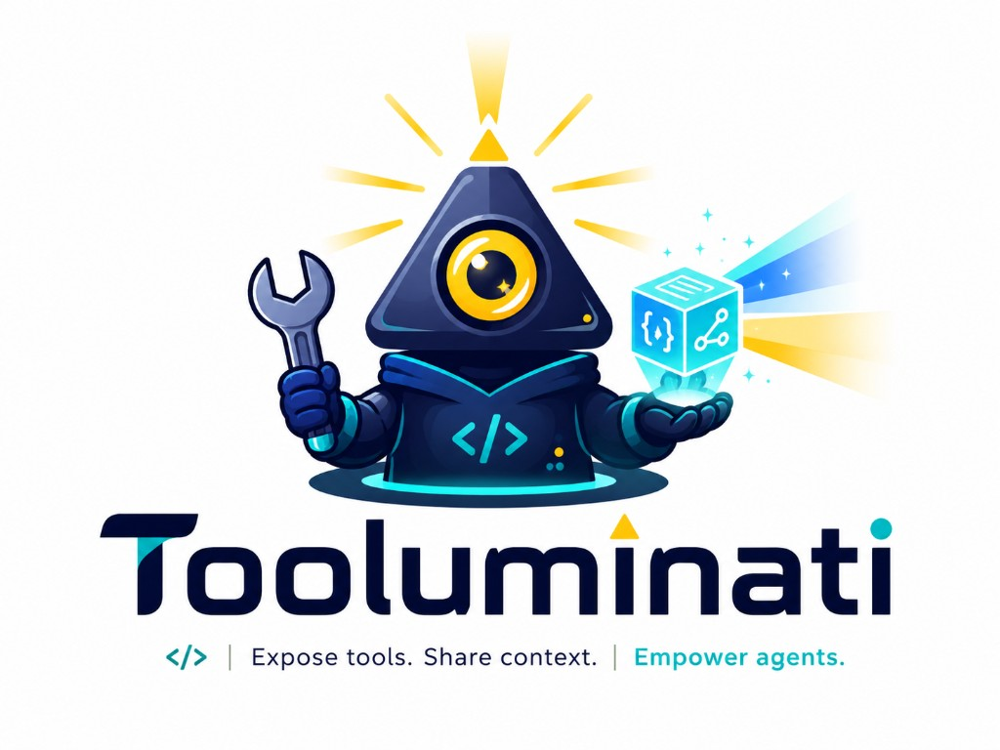

<p align="center">
  <a href="https://github.com/jitterbox/Tooluminati">
    
  </a>
</p>

<p align="center">
  <strong>Expose tools. Share context. Empower agents.</strong>
</p>

<p align="center">
  <a href="https://github.com/jitterbox/Tooluminati/actions/workflows/ci.yml">
    
  </a>
  <a href="LICENSE">
    
  </a>
</p>

Tooluminati is an opinionated **React and Angular** toolkit for the emerging WebMCP browser API.
It helps apps expose safe, structured diagnostics so agents can troubleshoot
forms, routers, data caches, action availability, errors, hydration, and
production security policy — not just register another `useWebMcpTool` hook.

WebMCP is experimental and currently requires browser flags or origin-trial
support. All `@tooluminati/*` APIs should be treated as pre-1.0 and subject to
change as the draft evolves.

## Install

### React

Primary packages:

```bash
pnpm add @tooluminati/core @tooluminati/react
```

### Angular

Primary packages:

```bash
pnpm add @tooluminati/core @tooluminati/angular
```

Guide: [docs/angular-getting-started.md](docs/angular-getting-started.md)

### Shared diagnostics bundle

```bash
pnpm add @tooluminati/core \
  @tooluminati/react \
  @tooluminati/diagnostics
```

Optional adapters:

```bash
pnpm add @tooluminati/policies \
  @tooluminati/forms \
  @tooluminati/router \
  @tooluminati/state \
  @tooluminati/testing \
  @tooluminati/devtools
```

Packages publish to npm under `@tooluminati/*`. See
[docs/releasing.md](docs/releasing.md) for maintainer publishing setup.

## Quick start

```tsx
import {
  WebMcpProvider,
  useWebMcpTools,
} from '@tooluminati/react';
import {
  createAppInfoTool,
  createActionAvailabilityTool,
} from '@tooluminati/diagnostics';

<WebMcpProvider enabled={import.meta.env.DEV}>
  <App />
</WebMcpProvider>;
```

Full guide: [docs/getting-started.md](docs/getting-started.md)

## Examples and comparative proof

Start with [examples/agent-troubleshooting-demo](examples/agent-troubleshooting-demo/README.md)
for a side-by-side DOM vs WebMCP demo with sample agent prompts and automated
proof tests. See [examples/README.md](examples/README.md) for the full matrix.

```bash
pnpm --filter agent-troubleshooting-demo dev
pnpm test:browser
```

## Packages

| Package | Description |
|---------|-------------|
| `@tooluminati/core` | Registry, browser adapter, security |
| `@tooluminati/react` | Provider, hooks, scopes, banner |
| `@tooluminati/policies` | Policy presets |
| `@tooluminati/diagnostics` | Diagnostic tool factories |
| `@tooluminati/forms` | React Hook Form adapters |
| `@tooluminati/router` | Router diagnostics |
| `@tooluminati/state` | Redux / TanStack Query adapters |
| `@tooluminati/testing` | Test and Playwright helpers |
| `@tooluminati/devtools` | Debug panel UI |
| `@tooluminati/angular` | Angular provider, scopes, banner |
| `@tooluminati/angular-forms` | Signal Forms / reactive form adapters |
| `@tooluminati/angular-router` | Angular Router diagnostics |
| `@tooluminati/angular-state` | NgRx / signal state adapters |
| `@tooluminati/angular-devtools` | Angular debug panel |

## Documentation

- [Getting started (React)](docs/getting-started.md)
- [Getting started (Angular)](docs/angular-getting-started.md)
- [Positioning](docs/positioning.md)
- [Security](docs/security.md)
- [Diagnostics tools](docs/diagnostics.md)
- [Chrome setup](docs/chrome-setup.md)
- [Releasing to npm](docs/releasing.md)

## Development

```bash
git clone https://github.com/jitterbox/Tooluminati.git
cd Tooluminati
pnpm install
pnpm check
pnpm build
pnpm test:browser
```

Contributing: [CONTRIBUTING.md](CONTRIBUTING.md)

## License

[MIT](LICENSE)
